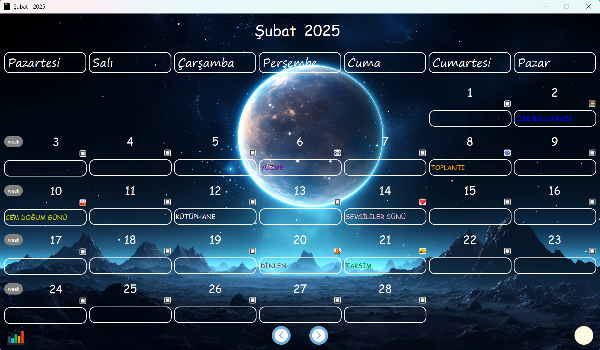
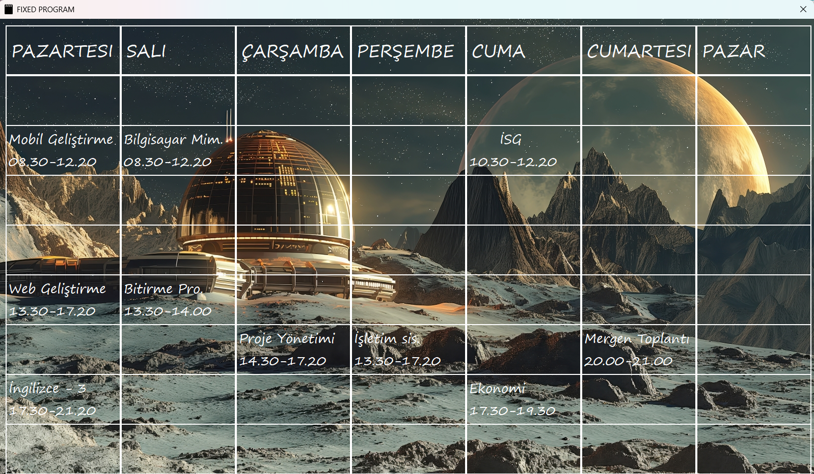
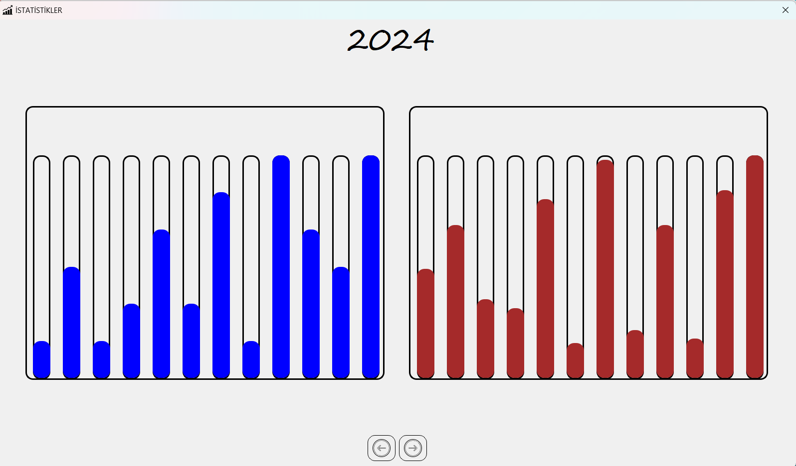
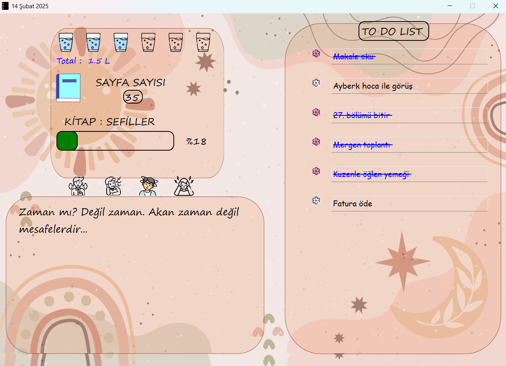

# LifeFlow

LifeFlow is a comprehensive desktop application that helps you track your daily habits and personal development.

## 🌟 Features

### 📅 Calendar and Schedule Management
- Create daily, weekly and monthly schedules
- Design fixed schedule templates
- Event categorization and color coding
- Flexible schedule editing

### 📚 Personal Development Tracking
- Reading progress tracking
- Daily water intake monitoring
- Emotional state recording
- Goal setting and progress tracking

### 📊 Statistics and Reporting
- Monthly and yearly progress charts
- Book reading statistics
- Water consumption analysis
- Visual progress reports

### 🎬 Media Archive
- Personal library management
- Movie archive
- Create watch/reading lists
- Media rating system

## 📸 Screenshots

  
  
  
  

## 🛠️ Technical Features
- Modern interface developed with Python and PyQt5
- Local data storage with SQLite database
- Customizable user interface
- Automatic data saving
- Multi-window management

## 🎯 Target Audience
- People who value personal development
- Those who want to organize their daily routines
- Users looking to track their habits
- People who want to keep records of their reading and movie watching hobbies

## 💡 Developer Notes
LifeFlow is designed to help users make their daily lives more organized and efficient. While guiding you on your personal development journey, the application allows you to see your progress with concrete data.
